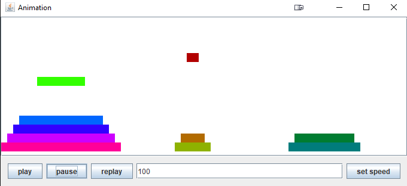
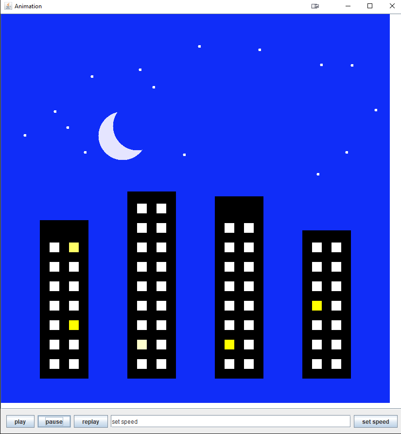
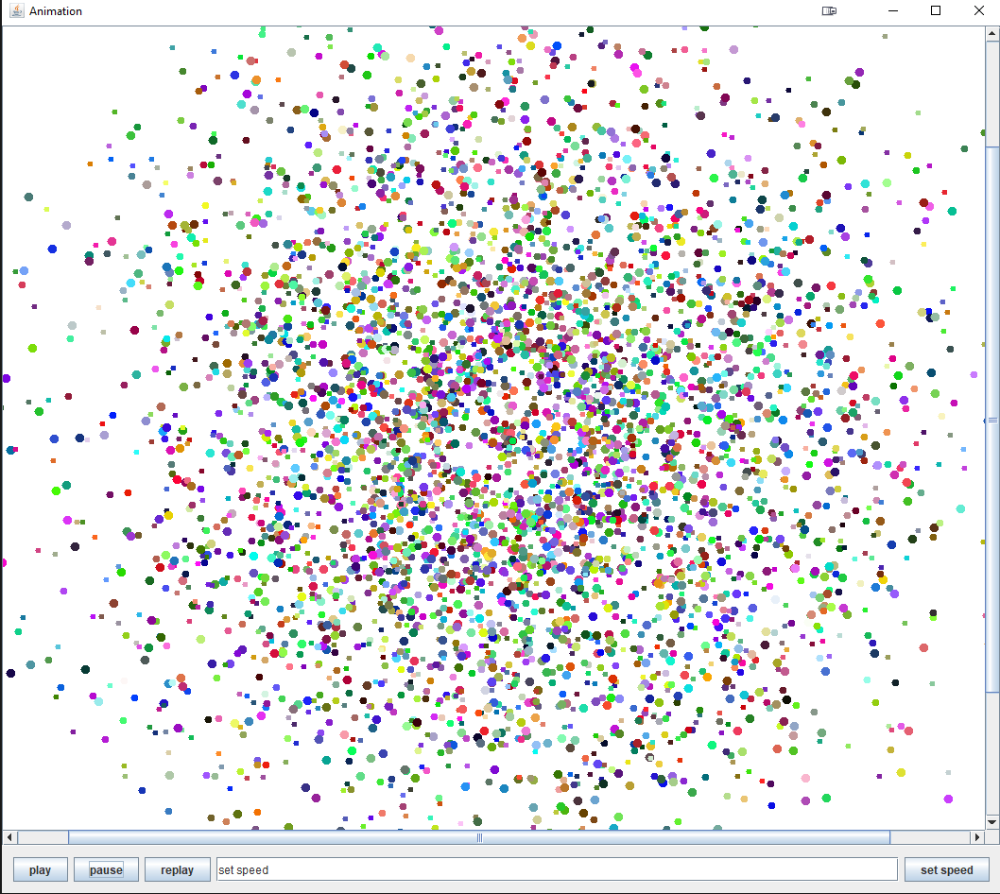

## Basic Animation will display custom animations

Linked below is a demo file. To see the animations, please download the file and run the .jar file.

<a href="https://github.com/GregoryNau/BasicAnimation/blob/gh-pages/BasicAnimation-Demo.zip" download="download">Download Demo File</a>

The demo file will then display, randomly, one of three animations (displayed below as snapshots of the animation).
This was done for ease of use, since the non-demo project is meant to be run with parameters from the command line.

### Hannoi Towers


### Buildings


### Big-Bang-Crunch


## The text format

If you wish to display a custom animation, create a .txt file and describe your animation using the following format.

```

# initializes the canvas, with top-left corner (200,70) and
# dimensions 360x360
canvas 200 70 360 360
# declares a rectangle shape named R
shape R rectangle
# describes the motions of shape R, between two moments of animation:
# t == tick
# (x,y) == position
# (w,h) == dimensions
# (r,g,b) == color (with values between 0 and 255)
#                  start                           end
#        --------------------------    ----------------------------
#        t  x   y   w  h   r   g  b    t   x   y   w  h   r   g  b
motion R 1  200 200 50 100 255 0  0    10  200 200 50 100 255 0  0
motion R 10 200 200 50 100 255 0  0    50  300 300 50 100 255 0  0
motion R 50 300 300 50 100 255 0  0    51  300 300 50 100 255 0  0
motion R 51 300 300 50 100 255 0  0    70  300 300 25 100 255 0  0
motion R 70 300 300 25 100 255 0  0    100 200 200 25 100 255 0  0

shape C ellipse
motion C 6  440 70 120 60 0 0 255 # start state
         20 440 70 120 60 0 0 255 # end state
motion C 20 440 70 120 60 0 0 255      50 440 250 120 60 0 0 255
motion C 50 440 250 120 60 0 0 255     70 440 370 120 60 0 170 85
motion C 70 440 370 120 60 0 170 85    80 440 370 120 60 0 255 0
motion C 80 440 370 120 60 0 255 0     100 440 370 120 60 0 255 0
```

Note: all animations can only use the basic shapes of rectangles and ellipses. Also all motions are assumed to describe constant velocity.

Once an animation has been described in a .txt file, run the jar file in the command line using the following parameters, where [file] gets replaced with the relative path to the animation .txt file.

```
-in [file] -view edit -speed 26
```

You should then see the animation you described run!
